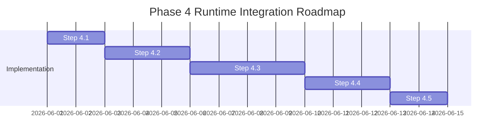

# Google AI Edge / Garden Architecture Analysis

> [!NOTE]
> **Historical note (2026-07-05):** The recommendation below to start with MediaPipe tasks-genai was superseded by ADR 12 in [docs/decision-log.md](decision-log.md) — LiteRT-LM was integrated first. The multi-provider abstraction advice remains valid.

This document completes **Phase 1 (Garden Analysis)** of the Android Edge LLM Server project. It outlines the architectural landscape, component maps, dependency signatures, model lifecycle workflows, and coupling controls required to transition safely into **Phase 4 (Runtime Integration)**.

---

## 1. Architectural Landscape: MediaPipe GenAI vs. LiteRT-LM

Google offers two primary, production-grade pathways for executing local large language models on Android devices. Since our target is a **24/7 Dedicated Server Profile**, selecting the correct engine is a critical strategic decision.

### Comparison Matrix

| Metric | MediaPipe Tasks GenAI (`tasks-genai`) | LiteRT-LM (`litertlm-android`) |
|---|---|---|
| **Ecosystem Status** | Established, widely documented. | Evolving, bleeding edge (formerly TFLite-LM). |
| **Model Formats** | `.task` (compiled from TFLite/safetensors) | `.litertlm` (compiled via Hugging Face/LiteRT converter) |
| **NPU Acceleration** | CPU & GPU via XNNPACK / TFLite GPU Delegate | Deeply optimized for custom NPUs (Tensor, Snapdragon, Dimensity) |
| **Streaming API** | Callback-based (`generateResponseAsync`) | Kotlin Flow-based (`sendMessageAsync().collect`) |
| **Inference Models** | Gemma 2B, Llama 3 8B (4-bit), Phi-2, Falcon 1B | Gemma 3 (all variants), modern NPU-supported models |
| **Lifecycle Overhead**| Lightweight, low C++ runtime initialization time | Heavy startup compilation/optimization phase |

### Architectural Decision

> [!NOTE]
> **Recommended Strategy:** Implement a **Multi-Provider Inference Abstraction**. 
> We will design a decoupled `InferenceProvider` interface. Our first concrete implementation will target **MediaPipe Tasks GenAI (`tasks-genai`)** due to its stable, multi-model compatibility (Gemma, Llama 3, Phi-2) which perfectly fits our goal of exposing OpenAI-compatible REST APIs. 
> In a subsequent iteration, we will implement a `LiteRtLmProvider` to leverage raw NPU performance on modern devices.

---

## 2. Runtime Component Map

To maintain the total isolation of the background server from the UI, the inference runtime must map to a clean, thread-safe service architecture.

```mermaid
graph TD
    subgraph UI Layer [UI Layer (MainActivity)]
        UI[Programmatic Console/Test UI]
    end

    subgraph Server Layer [Server Layer (LlmServerService)]
        Ktor[Ktor CIO Server Engine]
        SM[SessionManager]
        MM[ModelManager]
        IP["<<Interface>> <br> InferenceProvider"]
        MP[MediaPipeProvider]
        LR[LiteRtLmProvider]
    end

    subgraph System Layer [System / OS Layer]
        Wake[CPU Partial WakeLock]
        Wifi[Full WiFi Lock]
        LMK[onTrimMemory Handler]
    end

    UI <-->|Intents / ServerConsole| Ktor
    Ktor <-->|HTTP Requests| SM
    SM <-->|Coordinate Sessions| MM
    MM <-->|Load/Unload| IP
    IP <-->|Abstracts| MP
    IP <-->|Abstracts| LR
    MP <-->|Locks| Wake
    MP <-->|Locks| Wifi
    MP -.->|GC & Eviction| LMK
```

### Core Architecture Components

1. **`InferenceProvider` Interface:**
   - Methods: `init(modelPath: String)`, `generate(prompt: String): String` (blocking), `generateStream(prompt: String): Flow<String>` (streaming), `unload()`.
2. **`MediaPipeProvider` (Concrete implementation):**
   - Encapsulates the MediaPipe `LlmInference` native runtime.
   - Converts OpenAI and Ollama system + user chat templates into model-compatible prompts.
3. **`ModelManager`:**
   - Resolves model paths in device storage (e.g., `/sdcard/Download/` or app Scoped Storage).
   - Validates that model size is compatible with hardware memory using limits defined in `daemon-stability-guidelines.md`.
4. **`SessionManager`:**
   - Manages active HTTP request states.
   - Prevents parallel inference execution (since local hardware NPUs/GPUs can only process one inference context at a time, we must queue requests or return `503 Service Unavailable`).

---

## 3. Dependency Map

To support the runtime engines, we must declare external native libraries in our Android Gradle configuration.

### A. MediaPipe Tasks GenAI Dependencies

```kotlin
dependencies {
    // Core MediaPipe GenAI engine containing native libraries for CPU/GPU inference
    implementation("com.google.mediapipe:tasks-genai:0.10.14") // Stable benchmark target
    
    // Kotlin Coroutines Flow for async token collection
    implementation("org.jetbrains.kotlinx:kotlinx-coroutines-core:1.7.3")
    implementation("org.jetbrains.kotlinx:kotlinx-coroutines-android:1.7.3")
}
```

### B. ProGuard & Native Library Keep Rules (`proguard-rules.pro`)

Because these libraries make extensive use of JNI (Java Native Interface) to call low-level C++ engines, we must protect JNI entrypoints from compiler minification:

```proguard
# Preserve MediaPipe JNI entrypoints
-keep class com.google.mediapipe.tasks.genai.** { *; }
-keep class com.google.mediapipe.tasks.core.** { *; }

# Preserve LiteRT / TFLite native layers
-keep class org.tensorflow.lite.** { *; }
```

---

## 4. Model Lifecycle & Dedicated Storage Workflow

In standard mobile app development, developers bundle small models in the `assets` folder. However, this is **highly discouraged** for our dedicated edge server because:
1. Model files are huge (Gemma-2B is ~1.5GB; Llama-3-8B is ~4.8GB). Bundling them in the APK is impossible (Google Play limit is 150MB; Gradle compilation times would explode).
2. The `assets` directory is read-only and loaded inside a compressed zip format, adding extreme CPU/memory parsing overhead during startup.

### Storage Architecture Design

```text
[External Device Storage] /sdcard/Download/llm-server/models/
    ├── gemma-2b-it-gpu.task (MediaPipe Format)
    └── llama-3-8b-instruct.task (MediaPipe Format)
```

1. **Storage Permission:** 
   We will request `android.permission.READ_EXTERNAL_STORAGE` (or `MANAGE_EXTERNAL_STORAGE` on dedicated devices) to allow our service to read directly from `/sdcard/Download/llm-server/models/` without copying files.
2. **Model Loading Lifecycle:**
   - **Lazy Loading:** The server starts *without* loading any model into RAM. This ensures the Ktor REST server is instant-on and lightweight (~15MB RAM).
   - **Explicit Initializer:** A client call to `/v1/models` lists available models. The first chat call triggers model loading.
   - **Unload & GC:** If a model is inactive for a configurable idle timeout (e.g., 10 minutes) or if `onTrimMemory()` is triggered, the engine releases the C++ references and invokes `System.gc()` to clear heap space.

---

## 5. UI/Runtime Coupling Controls

To guarantee that the REST API engine remains active even if the user closes or swip-kills the main screen, we enforce absolute decoupling:

1. **Zero UI References:** `LlmServerService` must **never** reference `MainActivity` or any UI View.
2. **Thread Isolation:** The MediaPipe `LlmInference` engine must run strictly inside a dedicated single-threaded dispatcher (e.g., `Executors.newSingleThreadExecutor().asCoroutineDispatcher()`). The main UI thread is never blocked.
3. **Decoupled Logging:** Raw token statistics (Tokens per second, prompt evaluation time, latency) are written to `ServerConsole.kt` (thread-safe singleton), which `MainActivity` listens to only if active.

---

## 6. Integration Roadmap (Phase 4 Execution Strategy)

To prepare for Phase 4, we will execute the integration incrementally over five discrete, testable steps:



### Step-by-Step Transition Plan

*   **Step 4.1 [Dependencies]:** Modify `app/build.gradle.kts` to add `tasks-genai` and `proguard-rules.pro`. Validate that compiling via GitHub Actions succeeds with the new dependencies.
*   **Step 4.2 [Abstraction]:** Create `com.edge.llm.server.InferenceProvider` and `com.edge.llm.server.ModelManager`. Expose a mock implementation to ensure zero-risk routing.
*   **Step 4.3 [Integration]:** Implement the `MediaPipeProvider` class. Integrate it with `PowerManager.PARTIAL_WAKE_LOCK` to keep the CPU awake during generation.
*   **Step 4.4 [Server Bindings]:** Update `LlmServerService` Ktor POST routes (`/v1/chat/completions` and `/api/chat`) to call `InferenceProvider` instead of returning mock responses.
*   **Step 4.5 [Validation & Benchmarks]:** Test API execution time, memory trim routines, and latency. Document benchmarks.
